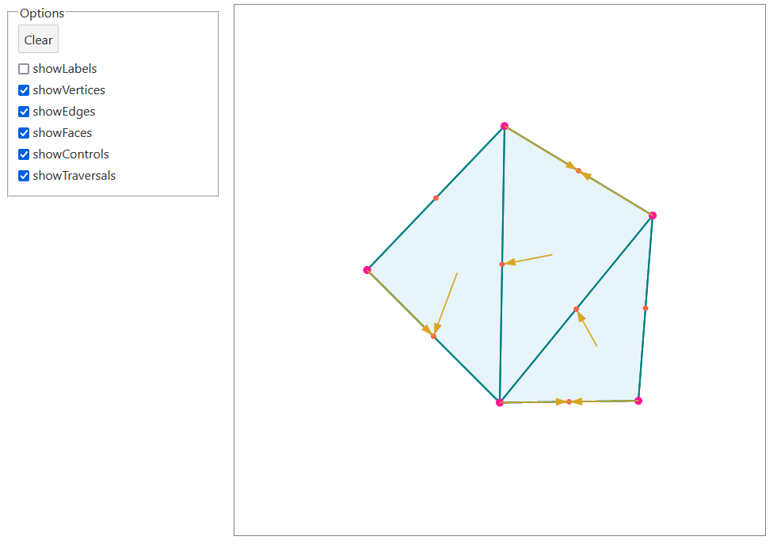

[Live Demo](https://static.laszlokorte.de/mesh/)

# Halfedge Data Structure (HDS)

An Halfedge Data Structure (HDS) is a data structure designed to represent geometric mesh data. It consists of a set of vertices (pink), faces (light blue) and edges (dark green) that are linked a particular way. Think of a multidimensional cyclic linked list.

Below you can insert vertices by clicking the orange dots in the middle of the edges. Vertices (pink) can be dragged around. Faces that are made up of more than three edges are marked by a little triangle. Clicking the triangle splits the corresponding face in two.